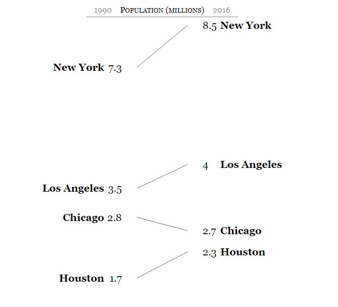

# viz
Visualization accessibility capstone project
Creates a visualization to show what NVDA sees when it parses a data visualization.

**How to Use**
1. Download and install NVDA.
2. Download or clone this repo.
3. Move firefox.py into \nvda\appModules. This directory can be found by searching for "Explore NVDA user configuration directory."
4. Unzip the accessibility_chart folder.
5. Run NVDA.
6. Open your data visualization in Firefox.
7. Exit NVDA.
8. Open \accessibility-chart\accessibility-chart\test-accessibility-chart.html and upload log.txt from \nvda\appModules.
9. Click outside of the upload file button and press any letter key to navigate through the generated visualization.

**Demo**
The data visualization pictured below was generated using the contents of \accessibility-chart\demo\Slopegraph\

Using the NVDA plugin generated the text file found in \accessibility-chart\demo\
Uploading that file in the visualization tool yielded the following results:

